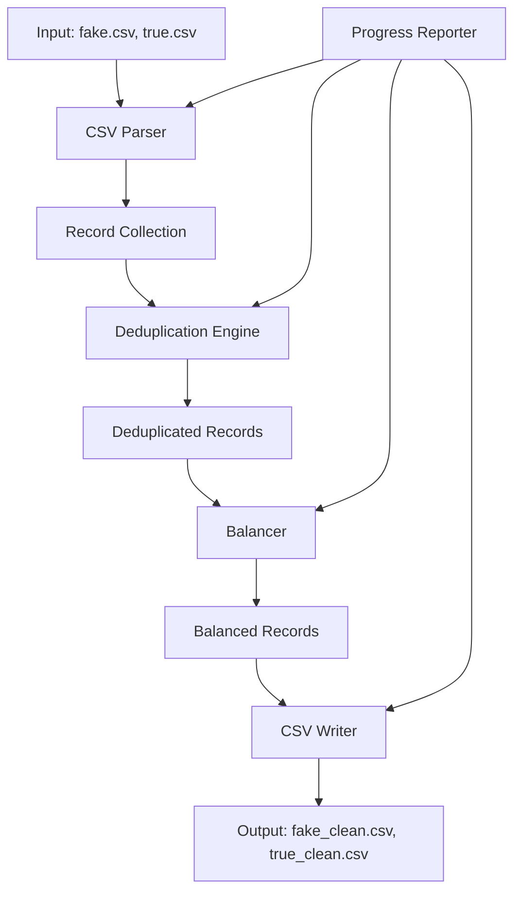

# Design Document: CSV Data Preparation Tool

## Overview

This document describes the design of a Rust-based CSV data preparation tool for processing news article datasets. The tool reads two CSV files (fake news and true news), removes duplicate entries based on content, balances the datasets to equal sizes through random sampling, and outputs the cleaned data to new CSV files.

The implementation leverages Rust's strong type system and the `csv` crate for efficient CSV parsing and writing, along with `serde` for serialization/deserialization.

## Architecture



### High-Level Flow

1. **Input Stage**: Read CSV files from disk
2. **Parsing Stage**: Parse CSV records into typed structs
3. **Deduplication Stage**: Remove duplicate records based on title + text hash
4. **Balancing Stage**: Randomly sample the larger dataset to match the smaller
5. **Output Stage**: Write balanced datasets to new CSV files
6. **Reporting**: Display progress and summary statistics throughout

## Components and Interfaces

### 1. Record Struct

```rust
#[derive(Debug, Clone, Serialize, Deserialize, PartialEq, Eq, Hash)]
pub struct Record {
    pub title: String,
    pub text: String,
    pub subject: String,
    pub date: String,
}
```

### 2. CsvLoader

Responsible for reading and parsing CSV files.

```rust
pub trait CsvLoader {
    fn load(path: &Path) -> Result<Vec<Record>, CsvError>;
}

pub struct FileCsvLoader;

impl CsvLoader for FileCsvLoader {
    fn load(path: &Path) -> Result<Vec<Record>, CsvError>;
}
```

### 3. Deduplicator

Removes duplicate records based on content hash.

```rust
pub trait Deduplicator {
    fn deduplicate(records: Vec<Record>) -> DeduplicationResult;
}

pub struct ContentDeduplicator;

pub struct DeduplicationResult {
    pub records: Vec<Record>,
    pub duplicates_removed: usize,
}
```

### 4. Balancer

Balances two datasets to equal sizes.

```rust
pub trait Balancer {
    fn balance(dataset_a: Vec<Record>, dataset_b: Vec<Record>, rng: &mut impl Rng) -> BalanceResult;
}

pub struct RandomBalancer;

pub struct BalanceResult {
    pub dataset_a: Vec<Record>,
    pub dataset_b: Vec<Record>,
    pub final_size: usize,
}
```

### 5. CsvWriter

Writes records to CSV files.

```rust
pub trait CsvWriter {
    fn write(path: &Path, records: &[Record]) -> Result<(), CsvError>;
}

pub struct FileCsvWriter;
```

### 6. Error Types

```rust
#[derive(Debug, thiserror::Error)]
pub enum CsvError {
    #[error("File not found: {0}")]
    FileNotFound(PathBuf),
    
    #[error("IO error: {0}")]
    Io(#[from] std::io::Error),
    
    #[error("CSV parsing error: {0}")]
    Parse(#[from] csv::Error),
}
```

## Data Models

### Record

| Field   | Type   | Description                          |
|---------|--------|--------------------------------------|
| title   | String | Article headline                     |
| text    | String | Full article content                 |
| subject | String | Category/topic of the article        |
| date    | String | Publication date as string           |

### Content Hash

For deduplication, a hash is computed from the concatenation of `title` and `text` fields. This allows efficient O(1) duplicate detection using a HashSet.

```rust
fn content_key(record: &Record) -> (String, String) {
    (record.title.clone(), record.text.clone())
}
```

### Processing Statistics

```rust
pub struct ProcessingStats {
    pub initial_fake_count: usize,
    pub initial_true_count: usize,
    pub fake_duplicates_removed: usize,
    pub true_duplicates_removed: usize,
    pub final_balanced_count: usize,
}
```


## Correctness Properties

*A property is a characteristic or behavior that should hold true across all valid executions of a system-essentially, a formal statement about what the system should do. Properties serve as the bridge between human-readable specifications and machine-verifiable correctness guarantees.*

### Property 1: CSV Round-Trip Consistency

*For any* valid Record, serializing it to CSV format and then parsing it back SHALL produce an equivalent Record with identical title, text, subject, and date fields.

**Validates: Requirements 1.1, 1.4, 4.1, 4.2**

### Property 2: Deduplication Uniqueness

*For any* collection of Records, after deduplication, no two Records in the result SHALL have the same (title, text) pair.

**Validates: Requirements 2.1**

### Property 3: Deduplication Preserves First Occurrence

*For any* collection of Records containing duplicates, the deduplicated result SHALL contain the first occurrence of each unique (title, text) pair in the original order.

**Validates: Requirements 2.2**

### Property 4: Deduplication Count Accuracy

*For any* collection of Records, the reported duplicates_removed count SHALL equal (original_count - deduplicated_count).

**Validates: Requirements 2.3**

### Property 5: Balance Size Equality

*For any* two collections of Records, after balancing, both collections SHALL have the same size equal to min(original_size_a, original_size_b).

**Validates: Requirements 3.1, 3.3**

### Property 6: Balance Subset Property

*For any* collection of Records that is reduced during balancing, the resulting collection SHALL be a subset of the original collection.

**Validates: Requirements 3.2**

## Error Handling

### File Errors

| Error Condition | Handling Strategy |
|-----------------|-------------------|
| File not found | Return `CsvError::FileNotFound` with path |
| Permission denied | Return `CsvError::Io` with underlying error |
| Invalid UTF-8 | Return `CsvError::Parse` with row information |

### CSV Parsing Errors

| Error Condition | Handling Strategy |
|-----------------|-------------------|
| Malformed row | Log warning, skip row, continue processing |
| Missing columns | Skip row, continue processing |
| Extra columns | Ignore extra columns, parse known fields |

### Processing Errors

| Error Condition | Handling Strategy |
|-----------------|-------------------|
| Empty input file | Process as empty dataset (0 records) |
| Both files empty | Output empty balanced files |
| Write failure | Return `CsvError::Io` with underlying error |

## Testing Strategy

### Property-Based Testing Library

This project will use **proptest** for property-based testing in Rust. Each property test will run a minimum of 100 iterations.

### Unit Tests

Unit tests will cover:
- Specific edge cases (empty files, single record, all duplicates)
- Error conditions (file not found, malformed CSV)
- Integration between components

### Property-Based Tests

Each correctness property will be implemented as a property-based test:

1. **Property 1 (Round-Trip)**: Generate arbitrary Records, serialize to CSV string, parse back, verify equality
2. **Property 2 (Uniqueness)**: Generate Records with potential duplicates, deduplicate, verify no duplicate keys
3. **Property 3 (First Occurrence)**: Generate Records with known duplicates, verify first occurrence retained
4. **Property 4 (Count Accuracy)**: Generate Records, deduplicate, verify count math
5. **Property 5 (Size Equality)**: Generate two Record collections, balance, verify sizes match
6. **Property 6 (Subset)**: Generate Records, balance, verify subset relationship

### Test Annotations

Each property-based test will be tagged with:
```rust
// **Feature: csv-data-prep, Property {N}: {property_text}**
// **Validates: Requirements X.Y**
```
